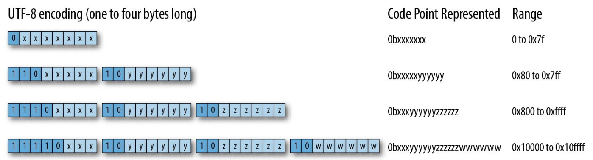

<!-- _class: lead -->
<!-- _paginate: false -->

# Programming Rust <br /> Ch. 16-17

Sanguk Park `efenniht@furiosa.ai`

---

## Ch 16. Collections


| Collection                      | Description          |
| ------------------------------- | -------------------- |
| `Vec<T>`                        | Growable array       |
| `VecDeque<T>`                   | Growable ring buffer |
| `LinkedList<T>`                 | Doubly linked list   |
| `BinaryHeap<T>`                 | Max heap             |
| `HashMap<K, V>`, `HashSet<T>`   | Hash table           |
| `BTreeMap<K, V>`, `BTreeSet<T>` | Binary tree          |

---

## `Vec<T>`
: A heap-allocated growable array

Its memory layout is same as `(buffer, capacity, length)`

Ways to create a vector:
 - `Vec::new()`
 - `vec![a, b, c, ...]`
 - `vec![elem; cnt]` (where `elem: T` and `T: Clone`)
 - `Vec::with_capacity(n)`
 - `iterator.collect::<Vec<_>>()`
 - `slice.to_vec()` where `T: Clone`.
 - ...

---

## Capacity
: Vector 는 length 와 capacity를 모두 가지고, 항상 `length <= capacity`.
 
 - `Vec::with_capacity(n)`
 - `vec.capacity()`
 - `vec.reserve(n)`: `n` 개의 원소를 **추가로** 저장할 수 있도록 capcity를 증가시킴.
    + `length + n <= capacity`
 - `vec.reserve_exact(n)`: 정확히 `length + n = capacity` 가 되도록 alloc.
 - `vec.shrink_to_fit()`: 정확히 `length = capcity` 가 되도록 dealloc.

---

## Insert & Remove
원소 한 개:
 - `vec.push(x)`, `vec.pop() -> Option<T>`: 가장 끝에 insert / remove
 - `vec.insert(idx, x)`, `vec.remove(idx) -> T`

원소 여러 개:
 - `vec.resize(new_len, value)`: `new_len` 에 맞게 원소 삭제 / `value` 추가
 - `vec.truncate(new_len)`: `length <= new_len` 이 되도록 원소 삭제
 - `vec.clear()`: 모두 삭제
 - `vec.extend(iter)`: collect iterator into `vec`
 - `vec.split_off(idx)`: `vec.truncate(idx)` 후 잘린 부분을 vector로 return.
 - `vec.append(other: &mut Vec<T>)`: `other` 모두 `vec` 뒤에 추가, `other`는 empty.
 - `vec.drain(range) -> impl Iterator<Item=T>`: `range` 의 원소들을 remove

---

## Selectively Remove

 - `vec.retain(test: Fn(&T) -> bool)`: `test` 결과가 참인 것만 남김

연속된 원소들을 제거:
 - `vec.dedup()`
 - `vec.dedup_by(same: Fn(&T, &T) -> bool)`: `same` 을 기준으로
 - `vec.dedup_by_key(key: Fn(&T) -> K)`: `key` 를 기준으로

---

## Deref to Slice

```rust
impl<T> Deref<Target=[T]> for Vec<T> { .. }
```

Slice 에 있는 메서드를 모두 사용 가능:
 - `slice.len() -> usize`, `slice.is_empty() -> bool`
 - `slice.first() -> Option<&T>` the first element, if any.
 - `slice.last() -> Option<&T>` the last element, if any.
 - `slice.get(idx: usize) -> Option<&T>` the `idx`-th element, if any.
 - `slice[idx] -> T` panics if `slice.len() <= idx`.
 - `slice.iter() -> impl Iterator<Item=&T>`

모두 `mut` 버전이 있습니다.

---

## Splitting Slice

 - `slice.split_at(idx: usize)` = `(&slice[..idx], &slice[idx..])`
    
    Use `split_at_mut` instead of `(&mut slice[..idx], &mut slice[idx..])`

 - `slice.split_first() -> Option<(&T, &[T])>`
 - `slice.split_last() -> Option<(&[T], &T)>`
 - `slice.split(is_sep: F)`: separator 에 따라 split, returns iterator
 - `slice.splitn(n: usize, is_sep: F)`: 최대 `n` 개만 split
 - `slice.rsplitn(n: usize, is_Sep: F)`: 최대 `n` 개만 역순으로 split
 - `slice.chunks(n: usize)`: n 개 단위로 split

모두 `mut` 버전이 있습니다.

---

## Join

 - `[[1, 2], [3, 4]].concat() == vec![1, 2, 3, 4]`
 - `[[1, 2], [3, 4]].join(&0) == vec![1, 2, 0, 3, 4]`

## Sort, Swap and Reverse
 - `slice.sort()`: 오름차순으로 정렬 (`T: Ord`)
 - `slice.sort_by(cmp: Fn(&T, &T) -> Ordering)`: `cmp` 의 비교 결과에 따라 정렬
 - `slice.sort_by_key(key: Fn(&T) -> K)`: 각 원소의 `key` 를 오름차순으로 정렬

위 함수는 모두 stable sort 이고, `unstable` 버전도 있습니다.

 - `slice.swap(x, y)`
 - `slice.reverse()`

---

## Search

 - `slice.binary_search(v: &T)`
 - `slice.binary_search_by(v: &T, cmp)`
 - `slice.binary_search_by_key(v: &T, key)`
<br />
- 해당하는 원소를 찾으면 위치를 `Ok(idx)` 로 리턴.
- 그렇지 않으면, 순서를 깨지 않고 `v`를 넣을 수 있는 위치를 `Err(idx)` 로 리턴.
<br />
- `slice.contains(v: &T) -> bool`
- 위치를 알려면: `slice.iter().position(|x| *x == v)`

---

## Compare

 - `[1, 2, 3] == [1, 2, 3]`, `[1, 2] != [1, 2, 3]`
 - `[1, 2, 3] < [1, 2, 4]` (lexicographical order)
 - `slice.starts_with(other: &[T])`
 - `slice.ends_with(other: &[T])`

## Random

`rand` crate 필요.

 - `rng.choose(slice: &[T]) -> Option<&T>`
 - `rng.shuffle(slice: &mut [T])`

---

## No Invalidation Error

```rust
for (idx, &val) in vec.iter().enumerate() {
    if val < 4 {
        vec.remove(idx); // ERROR: can't borrow `vec` as mutable
    }
}
```

$\Rightarrow$

```rust
vec.retain(|&x| x >= 4)
```

---

## `VecDeque<T>`

: Double-ended queue (a ring buffer)

 - `deque.push_front(value)` / `deque.push_back(value)`
 - `deque.pop_front()` / `deque.pop_back()`: 앞 / 뒤의 원소 move out
 - `deque.front()` / `deque.back()`: 앞 / 뒤의 원소 reference

`Vec<T>` 의 많은 API 그대로 사용 가능:
 - `VecDeque::with_capacity(n)`
 - `deque.insert(idx, v)` / `deque.remove(idx)`
 - `deque.extend(iter)`
 - `deque.iter()`

---

## NOT Deref to `VecDeque<T>`

`VecDeque<T>` 는 ring buffer이므로 slice 로 deref는 불가능

ex) sort, binary search, split, ...

하지만 `VecDeque<T>` 에 맞게 구현된 메서드들도 있음
 - `deque.len()` / `deque.is_empty()`
 - `deque.swap(x, y)`
 - `deque[idx]` (not `deque[range]`)

## `VecDeque<T>` $\leftrightarrow$ `Vec<T>`

 - `Vec::from(deque)`: $O(n)$
 - `VecDeque::from(vec)`: $O(n)$ (reallocation 이 필요할 때만)

---

## `LinkedList<T>`

: A doubly linked list

 - `VecDeque<T>` 의 API, indexing 제외
 - 대부분의 경우 `Vec<T>` 또는 `VecDeque<T>` 가 더 좋음
 - `list1.append(&mut list2)`: $O(1)$

## `BinaryHeap<T>` where `T: Ord`

: A priority queue (max heap)

 - `heap.push(value)` / `heap.pop()` / `heap.peek()`
 - `heap.iter()`: not ordered

간단한 `Vec<T>` 의 APIs: `heap.len()` / `heap.is_empty()` / `heap.capacity()` ...

---

## `HashMap<K, V>` and `BTreeMap<K, V>`

: A key-value map

생성:
 - `HashMap::new()` / `BTreeMap::new()`
 - `iter.collect()` (`iter: impl Iterator<Item=(K, V)>`)
 - `HashMap::with_capacity()`

조회:
 - `map.len()` / `map.is_empty()`
 - `map.contains_key(&key)`
 - `map.get(&key) -> Option<&V>` / `map.get_mut(&key) -> Option<&mut V>`

---

insert & remove:
 - `map.insert(key, value) -> Option<V>`: Returns old value
 - `map.extend(iter)`
 - `map.append(&mut map2)`
 - `map.remove(&key) -> Option<V>`
 - `map.clear()`

`map[&key]` 로 indexing할 수 있지만, `*map[&key] = value` 는 안 됨.

BTreeMap-specific:
 - `btree_map.split_at(&key) -> BTreeMap<K, V>`
   : `key` 보다 작은 것들은 남기고, 나머지를 return.

---

## `Entry` API

```rust
if !map.contains_key("a") {
  map.insert("a".to_string(), vec![]);
}
let record = map.get_mut("a").unwrap();
```
$\Rightarrow$
```rust
let record = map.entry("a".to_string()).or_insert_with(|| vec![]);
```

존재하는 / 존재하지 않는 entry에 대한 consistent 접근을 위한 API

 - `map.entry(key).or_insert(value) -> &mut V`
 - `map.entry(key).or_insert_with(fn: F) -> &mut V` (`F: FnOnce() -> V`)

---

## Map iteration

 - `map.iter() -> impl Iterator<Item=(&K, &V)>`
 - `map.iter_mut() -> impl Iterator<Item=(&K, &mut V)>`
 - `map.into_iter() -> impl Iterator<Item=(K, V)>`
 - `map.keys() -> impl Iterator<Item=&K>`
 - `map.values() -> impl Iterator<Item=&V>`
 - `map.values_mut() -> impl Iterator<Item=&mut V>`

`BTreeMap` 의 경우 순서대로 visit.

---

## `HashSet<T>` and `BTreeSet<T>`

`HashSet<T> = HashMap<T, ()>`, `BTreeSet<T> = BTreeMap<T, ()>`

기본적인 create, search, iteration 은 같음.

 - `set.get(&value) -> Option<&T>`: value 와 같은, `set` 내부의 값을 ref
 - `set.take(&value) -> Option<T>`
 - `set.replace(value)`

Set operation:

 - `set1.intersection(&set2)` (-> iterator) / `&set1 & &set2` (-> set)
 - `set1.union(&set2)` / `&set1 | &set2`
 - `set1.difference(&set2)` / `&set1 - &set2`
 - `set1.symmetric_difference(&set2)` / `&set1 ^ &set2`
 - `set1.is_disjoint(&set2)` / `set1.is_subset(&set2)` / `set1.is_superset(&set2)`

---

## Hashing

 - Default implementation: `#[derive(Hash)]`
 - Manual implementation:
   ```rust
   impl Hash for Ty {
     fn hash<H: Hasher>(&self, hasher: &mut H) {
       self.id.hash(hasher);
     }
   }
   ```
   + hashing algorithm 은 `Hasher` 가 담당
   + 어떤 것을 해싱할지, 어떤 순서인지만 결정
   + Principle: `a == b` then `hash(a) == hash(b)`

---

## Custom Hashing Algorithm

```rust
[dependency]
fnv = 1.0
```

```rust
use fnv::FnvHashMap as HashMap;
use fnv::FnvHashSet as HashSet;
```

---

## Ch 17. Strings and Text

---

## Encoding

: 문자열을 바이트로 나타내는 방법

 - ASCII: 알파벳 포함 주요 문자 128 개를 0x00-0x7f 에 대응
 - Latin-1: ASCII 를 포함, 256 개 문자를 0x00-0xff 에 대응
 - EUC-KR: 한글 한 글자를 2바이트에 대응
 - Unicode: 세상 모든 문자를 4바이트 Unicode point 에 대응

---

## UTF-8
: Unicode 를 바이트 단위로 압축



Rust의 `str` 타입은 항상 UTF-8로 인코딩된 문자열

---

## UTF-8 의 장점

 - ASCII 영역 (0x00-0x7f) 이 그대로 대응됨: 올바른 ASCII string은 올바른 UTF-8 string
 - 중간부터 파싱해도 다음 character가 어딘 지 $O(1)$ 로 알 수 있음
 - UTF-8 문자의 일부가 다른 UTF-8 문자가 아님;
 문자열을 검색하기 위해서 바이트 수준의 검색을 해도 안전.

---

## `char`

: A 32bit Unicode code point.

 - `ch.is_numeric()` / `ch.is_alphabetic()`
 - `ch.is_alphanumeric() == ch.is_numeric() || ch.is_alphabetic()`
 - `ch.is_whitespace()` / `ch.is_control()`
 - `ch.is_lowercase()` / `ch.to_lowercase()`
 - `ch.is_uppercase()` / `ch.to_uppercase()`

모든 분류는 Unicode 표준의 정의에 따름. ASCII 범위에서만 작동하는 것들은:

 - `ch.is_digit(radix)` / `ch.to_digit(radix)`
 - `ch.is_ascii_alphabetic()`
 - `ch.is_ascii_whitespace()`
 - ...

---

## `char` conversion to and from integers

- `char` $\to$ `{integer}` (e.g. `u8`, `i32`, ...) 는 항상 `as` 로 가능.
- `u8` $\to$ `char` 도 `as` 로 가능.
- `u32` $\to$ `char`: `char::from_u32() -> Option<char>` 사용

---

## `String`

`Vec` 과 유사한 API로 생성:

 - `String::new()`, `String::with_capacity()`
 - `iter.collect::<String>()`: 이때 `iter` 는 `&str`, `String`, or `char` 의 iterator
 - `slice.to_string()` / `slice.to_owned()`

insert:
 - `str.push(ch)` / `str.push_str(&str2)`
 - `str.extend(iter)`
 - `str.insert(i, ch)` / `str.insert_str(i, &slice)`
 - `"abc".to_string() + "def"` 

`str` 의 기본 indexing은 바이트 단위로 이루어지되, 경계가 character 가 아니면 panic

---

remove:
 - `string.clear()`
 - `string.truncate(n)`
 - `string.pop()`
 - `string.remove(idx)`
 - `string.drain(range)`


## Deref to `str`


- `str.len()` / `str.is_empty()`
- `str[idx]` / `str.split_at(idx)`
- `str.is_char_boundary(idx)`

---

## Search, Replace, and Trim
Pattern 은 `char`, `&str`, `&[char]` 또는 `FnMut(char) -> bool`
`&[char]` 는 slice 내의 `char` 중 어느 것이라도 pattern으로 매칭
 - `slice.contains(pattern)`
 - `slice.starts_with(pattern)` / `slice.ends_with(pattern)`
 - `slice.find(pattern)` / `slice.rfind(pattern)`: 찾은 byte offset을 return
 - `slice.replace(pattern, str)`
 - `slice.replacen(pattern, str)` 최대 `n` 번
 - `slice.trim()`: 처음과 끝의 whitespace를 제거한 subslice를 return
 - `slice.trim_left()` / `slice.trim_right()`
 - `slice.trim_matches(pattern)` / `slice.trim_left_matches(pattern)` / `slice.trim_right_matches(pattern)`

---

## Iterating

 - `slice.chars()`: `char` 단위로 iterate
 - `slice.char_indices()`: `(offset, char)` 를 iterate
 - `slice.bytes()`: `u8` 단위로 iterate
 - `slice.lines()`: line 단위로, line separator 는 `"\n"` 또는 `"\r\n"`.
 - `slice.split(pattern)` / `slice.rsplit(pattern)`
 - `slice.split_terminator(pattern)` / `slice.rsplit_terminator(pattern)`
   : 가장 마지막에 pattern이 매칭되면, empty slice `""` 를 visit하지 않음
 - `slice.splitn(n, pattern)`, `slice.rsplitn(n, pattern)`
 - `slice.split_whitespace()`: `char::is_whitespace()` 를 기준으로 split
 - `slice.matches(pattern)` / `slice.rmatches(pattern)`: `pattern` 과 매치되는 subslice 를 iterate
 - `slice.match_indices(pattern)` / `slice.rmatch_indices(pattern)`

---

## Conversion with other types

 - Others to `String`: `FromStr::from_str(&self) -> Result<T, FromStr::Err>`
   e.g. `i32::from_str("17") == 17`
 - `String` to Others: `ToString::to_string(&self) -> String`
   + 구현할 때는 `fmt::Display` 를 구현
<br />
 - `String` to UTF-8 bytes:
   + `slice.as_bytes()` returns `&[u8]`
   + `string.into_bytes()` returns `Vec<u8>`
 - UTF-8 bytes to `String`:
   + `str::from_utf8(bytes: &[u8]) -> Result<str, Err>`
   + `String::from_utf8(vec) -> Result<String, Err>`
   + `String::from_utf8_lossy(bytes: &[u8])`: 올바르지 않은 UTF-8 문자는 지움
   + `str::from_utf8_unchecked(bytes)`: `unsafe`, UTF-8인지 검사 생략.

