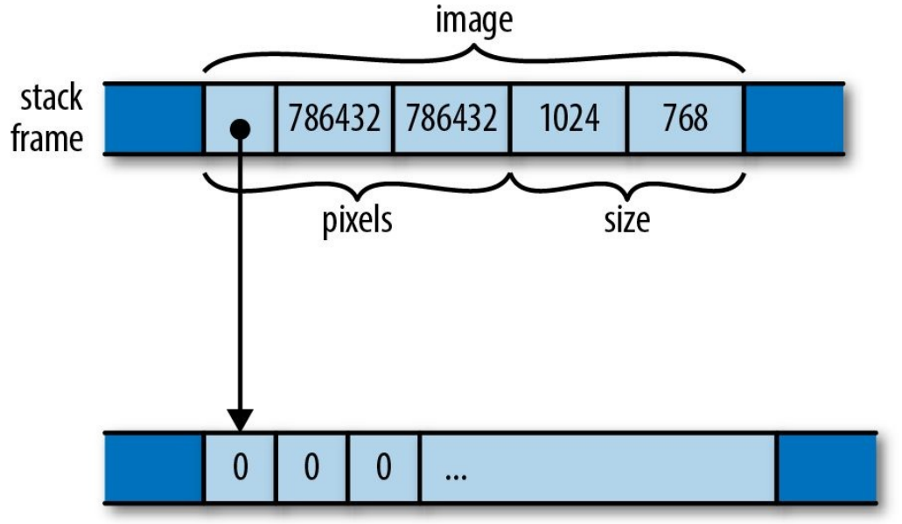

<!-- _class: invert lead -->
<!-- _paginate: false -->

# Programming Rust<br /> Ch. 8-9

Sanguk Park <small>`efenniht@furiosa.ai`</small>

---

## Ch 8. Crates and Modules

 - **Crate**: a Rust project
   - a library
   - executables
   - tests
   - examples
   - ...

---

## Crates

```
$ cargo build --verbose
...
Compiling mandelbrot v0.1.0 (file://.../mandelbrot)
Running `rustc src/main.rs
--crate-name mandelbrot
--crate-type bin
--extern crossbeam=.../libcrossbeam-ba292320058da7df.rlib
--extern image=.../libimage-254ec48c8f0684f2.rlib
...`
```

`--extern` from `[dependencies]` section in `Cargo.toml`

---

## Traditional Build System in C/C++


 - A single compilation unit:
   each of `.c` file ( $\to$ `.o`)
 - External dependency:
   prebuilt `.a` or `.so` files
 - Build system (`make`, `cmake`)
   orchestrates compiler and linker

---

## Build System in Rust

**Crate**: unit of compilation and distribution

 - A single compilation unit
   `rustc` compiles each crate (`*.rs`) into binary or library (`.rlib`)
 - External dependency
   `cargo` downloads and manages dependencies
 - Build system: `cargo`

---

## `Cargo.toml` - dependencies
 - downloaded from crates.io
 - use [semantic versioning](https://semver.org/lang/ko/)

```toml
[dependencies]
foo = "1.3.5"   # latest 1.x.y
bar = "0.3.7"   # latest 0.3.x
baz = "=1.2.2"  # exactly 1.2.2
qux = ">=1.0.5" # 1.0.5 or higher
image = { path = "vendor/image" }
image = { git = "https://github.com/Piston/image.git", rev = "528f19c" }
```

 - No need of `extern crate` in Rust 2018.
---

\
\
`Cargo.lock` fixes version for reproducible build

 - include in VCS if a crate produces binary, `.a` or `.so`
 - otherwise, don't.

---

## `Cargo.toml` - build profiles

```toml
[profile.dev]           # [profile.debug] changed its name

[profile.release]
debug = true            # add debug symbol
overflow-checks = true

[profile.dev.package."*"]
opt-level = 2           # optimize dependencies in debug build
```

https://doc.rust-lang.org/cargo/reference/profiles.html

---

## `Cargo.toml` - targets

Small binaries using the same codebase

 - `src/bin`
 - `tests`
 - `examples`
 - `benches` (nightly only)

https://doc.rust-lang.org/cargo/reference/cargo-targets.html

---

## Module

 - A Rust version of namespace
 - A collection of items (functions, types, structs, ...)
 - can nest

```rust
mod foo {
    mod bar {
        ...
    }
}
```

---

\
Load a module from a file:
  `mod baz;` loads `baz.rs` or `baz/mod.rs` into `baz`

In [Clear explanation of Rust’s module system](http://www.sheshbabu.com/posts/rust-module-system/):

<div style="color:gray">

> This is because we need to explicitly build the module tree in Rust - there’s no implicit mapping between file system tree to module tree.

</div>

---

## Path and Import

 - `::` path qualifier
   - `::std::mem::swap`: absolute path.
 - `use`: import name into current module
   ```rust
   use std::mem::swap;
   use std::collections::{self, HashMap, HashSet};
   use std::io::prelude::*; // import everything, recommended only for prelude
   use std::io::Write as _; // import but do not name it; useful for traits
   use std::fmt::Write as FmtWrite; // rename
   ```
 - Standard prelude: `Vec`, `From`, `Into`, `String`, etc.

---

## Visibility

 - Visibility controlled at the level of modules (unlike C++)
 - Default is private
   - Only accessable by the current module and descendants.
 - `pub`: mark an item public. 

---

## Item

 - Functions
 - Types
 - Type alias `type T = ...;`
 - `impl` blocks
 - Constants
 - Modules
 - Imports
 - `extern` blocks

---

## Attributes

Miscellaneous instructions and advice to the compiler

 - Disable and force warnings: `#[allow(..)]` and `#[deny(..)]`
 - Conditional compilation: `#[cfg(..)]`
 - Inlining over crates: `#[inline]`
 - Unstable features `#[feature(..)]`
 - Tests `#[test]` and documentation `#[doc]` (better use `///`)

Use `#![..]` for top level attributes

---

## Workspaces

- collects many crates into one build directory
- reduces compilation time and disk space

Limitations: crates cannot have circular dependencies; modules can.

---
 
\
\
\
` `

## Ch 9. Structs

---

### Named-field structs

```rust
struct GrayScaleMap {   // CamelCase
    pixels: Vec<u8>,
    size: (usize, usize),
}
```
Fields can be private despite of publicity of struct.

Struct expression:

```rust
GrayScaleMap { pixels: Vec::new(), size: (3, 4) }
GrayScaleMap { pixels: pixels, size: size } == GrayScaleMap { pixels, size }
```

---

No language-defined constructor; conventionly `fn new() -> Self`

```rust
let v = Vec::new();
let set = HashSet::new();
```

Other costructors can have different names:

```rust
let w = Vec::with_capacity(10);
let zet = HashSet::with_hasher(RandomState::new());
```

---

## Tuple-like structs

```rust
struct Range(usize, usize); // needs semicolon
struct Range(pub usize, pub usize); // fields can be public
```

 - Fields can be accessed like `range.0`.
 - Struct name works as function:

```rust
struct Foo(usize, usize);

fn check_func<T, F: Fn(usize, usize) -> T>(f: F) {}
fn main () {
    check_func(Foo);
}
```

---

## Unit-like structs

```rust
struct Unit;
```

 - Only have **one** valid value (unlike `!` and `enum Void {}`)
 - `std::mem::size_of::<Unit>() == 0`
 - Useful with traits (e.g. `rand::distributions::Uniform` (see [here](https://docs.rs/rand/0.7.3/rand/distributions/struct.Uniform.html))

---

## Struct Layout

 - store fields directly in the struct's block



 - Other memory layout is implementation-defined.
 - Use `#[repr(C)]` to be compatible with C.

---

## Defining Methods

 - Define methods in `impl` block (can be many)
 - Methods' first argument is `self`

```rust
impl Foo {
    fn new() -> Self {} // a static method
    fn foo(self) {}     // = fn foo(self: Self) {}
    fn bar(&self) {}    // = fn bar(self: &Self) {}
    // `self` must be a type of Self, references to Self, or #[fundamental]
    fn qux(self: Box<Self>) {}
}
```
 - Method can be called like `foo.bar()`  (works like `Foo::bar(&foo)`)

---

## Generic Structs

```rust
pub struct Queue<T> {
    older: Vec<T>,
    younger:Vec<T>,
}

impl<T> Queue<T> {  // impl also takes type parameter
    fn new() -> Self {  // Self aliases to Queue<T> (not Queue)
        ..
    }
}

let mut q = Queue::<char>::new(); // use turbofish in value position
let mut p: Queue<char> = Queue::new(); // don't use turbofish in type position
```

---

## Lifetime parameters

```rust
struct Extrema<'elt> {
    greatest: &'elt i32,
    least: &'elt i32
}
```
 - Works almost same as type parameter.
 - Lifetime elision works on generics:

```rust
fn foo(slice: &[u32]) -> &u32; // = fn foo<'s>(slice: &'s [u32]) -> &'s u32;
fn bar(slice: &[u32]) -> Extrema; // = fn bar<'s>(slice: &'s [u32]) -> Extrema<'s>;
```

---

## Interior Mutability

 - Cannot explain in one slide
 - To be continue...